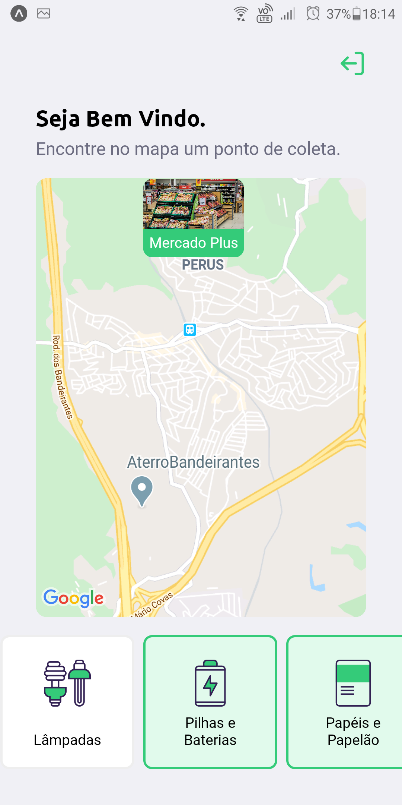

<h4 align="center">

<br><br>
♻️ Seu marketplace de coleta de resíduos ♻️
</h4>


## :bulb: Next Level Week #2 - Ecoleta

The **Ecoleta** project it is an initiative of Rockeatset during the second Next Level Week.
The project aims to help people who are interested in disposing of waste that could harm the environment in suitable places where they can be recycled and reused.
With it, an establishment can perform a registration informing its location and types of items that it recycles such as lamps, kitchen oil, cardboard, etc.
With the mobile app, anyone can search for nearby establishments that collect the recyclable items they want to dispose of.

<br/>

## 🚀 Technologies

<code></code> 
<code></code> 
<code></code> 
<code></code> 
<code></code> 
<code></code> 


<br/>

# :computer: WEB Layout

<p align="center">
  
  
  
  
  
</p>

# :iphone: Mobile Layout

<p align="center">
  

  

  

  
</p>

<br/>

## :information_source: How To run?

To clone and run this application, you'll need [Git](https://git-scm.com), Node.js and Yarn installed on your computer.

### Running API 

```bash
# Clone this repository
$ git clone https://github.com/SarahToscano/NLW-2

# Go into the repository
$ cd NLW-2/server

# Install dependencies
$ npm install

# Run Migrates
$ npm run knex:migrate
$ npm run knex:seed

# Start server
$ npm start

# running on port 3333
```

### Running Web Front-ed 

```bash

# Go into the repository
$ cd NLW-2/web

# Install dependencies
$ npm install

# Start application
$ npm start

# running on port 3333
```


### Running App Mobile

You must have installed on your computer and cellphone the [Expo](https://expo.io/).

```bash

# Go into the repository
$ cd NLW-2/mobile

# Install dependencies
$ npm install

# Start application
$ expo start

#Now, open the Expo app on your cellphone and read the QRcode.
```

